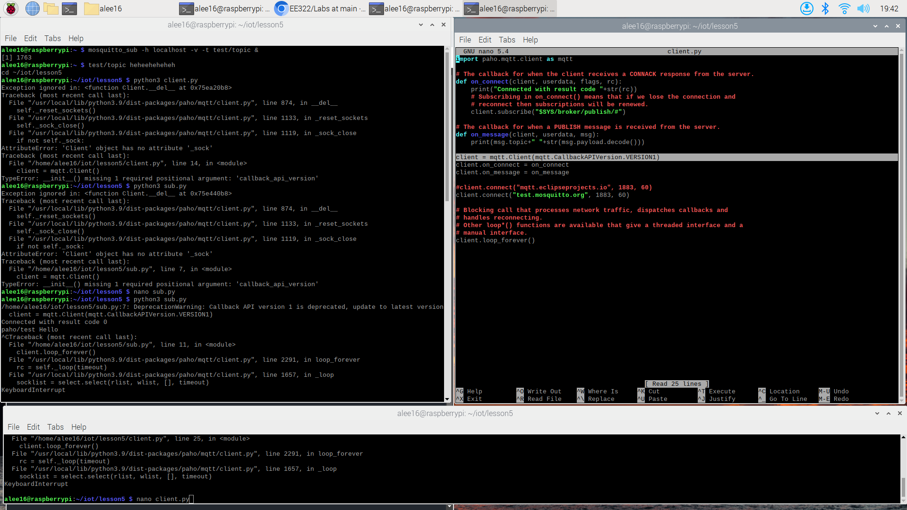
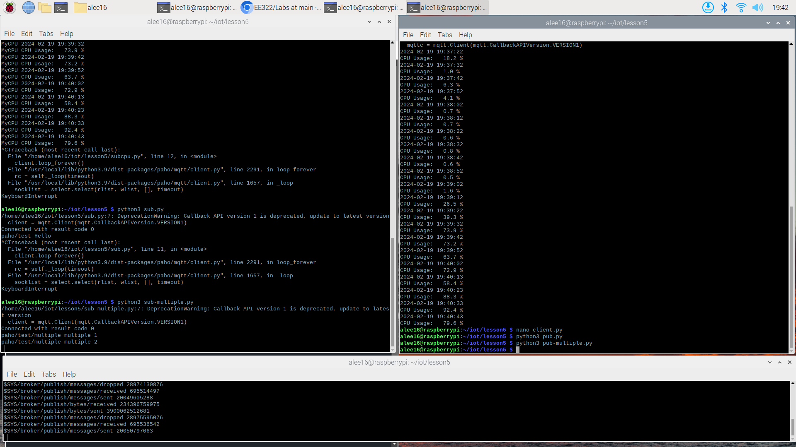
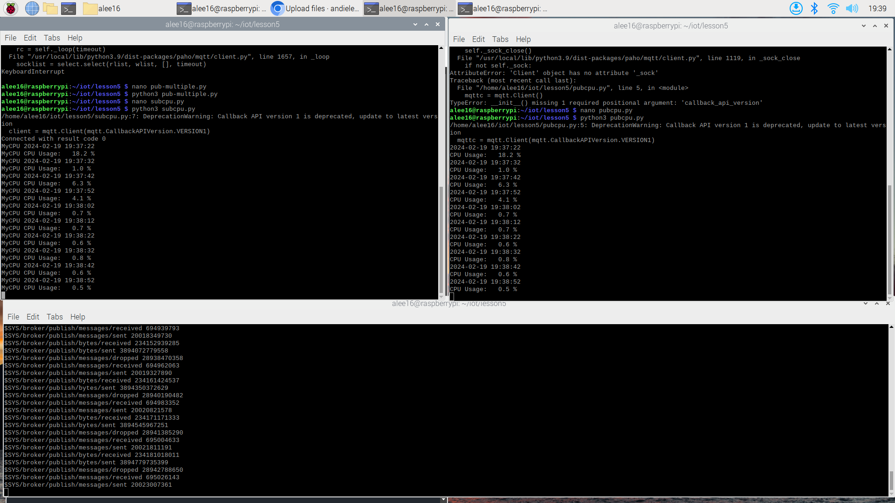

# Lab 5: Paho-MQTT

Due to Paho-MQTT updating on 2/11 to v2.0.0, the provided scripts required a line to be updated.
*OLD* ``` client = mqtt.Client() ```
*NEW* ``` client = mqtt.Client(CallbackAPIVersion.VERSION1) ```
These changes are highlighted in this image.

---
Test of sub/pub.py & sub/pub-multiple.py

---
The CPU test

