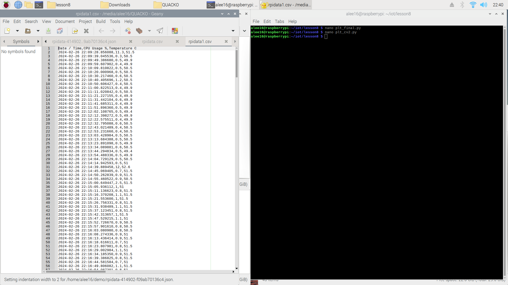
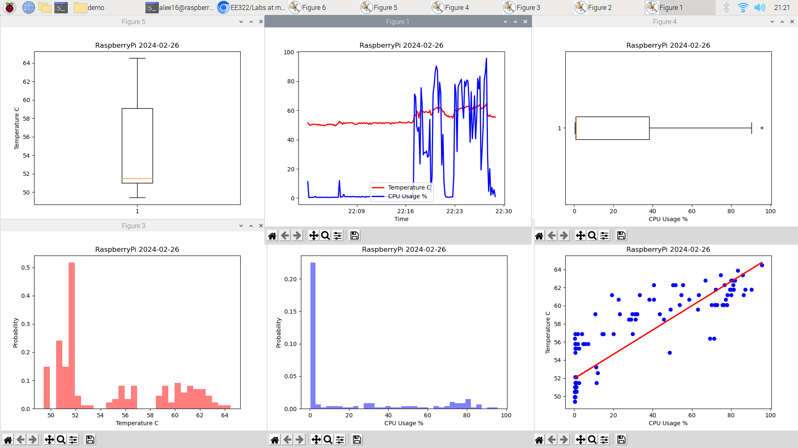
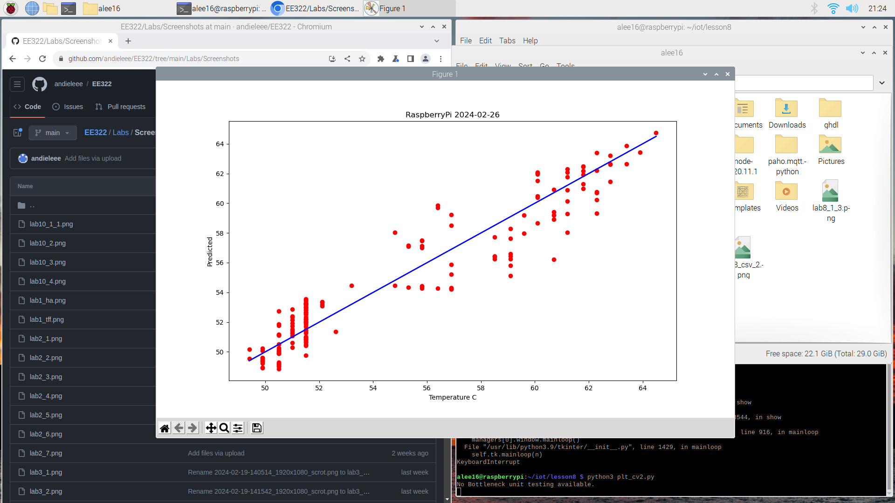

# Lab 8: Data Analysis

I was unable to install tensorflow due to the io file system not being able to installed on my Raspberry Pi Model & not enough RAM to run bazel & tensorflow.
Tensorflow requires ~6 gb of ram to run, while this Pi only has 1 gb + 2 gb from swap memory.

CSV Data

---

---

---
